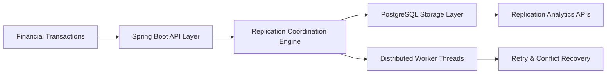
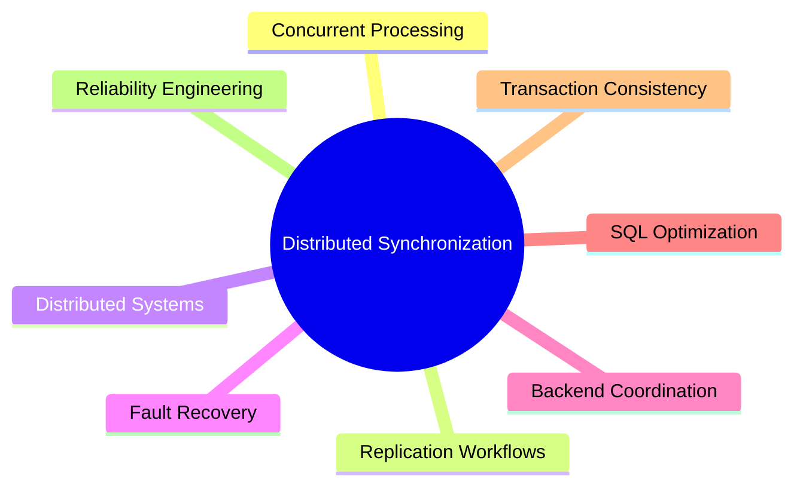

<div align="center">

# DISTRIBUTED TRANSACTION SYNCHRONIZATION ENGINE

### Concurrent Replication • Financial Data Consistency • Distributed Backend Synchronization


<br>


</div>

---

# Overview

The Distributed Transaction Synchronization Engine is a scalable backend replication platform engineered to support concurrent synchronization of financial transaction records across distributed execution environments.

The platform focuses on:

- Distributed transaction replication
- Concurrent synchronization workflows
- Fault-tolerant recovery handling
- Financial consistency validation
- Backend coordination systems
- High-throughput replication pipelines
- Transactional reliability engineering

The architecture is optimized for distributed backend infrastructures where transactional consistency, synchronization reliability, and concurrent processing are critical operational requirements.

---

# Engineering Objectives

```yaml
Core Objectives:
  - Distributed Replication
  - Concurrent Synchronization
  - Fault Recovery Engineering
  - Transaction Consistency
  - Backend Coordination
  - Replication Reliability
  - Scalable Synchronization Workflows
````

---

# Distributed Synchronization Workflow



---

# Key Engineering Capabilities

| Capability              | Description                               |
| ----------------------- | ----------------------------------------- |
| Distributed Replication | Multi-node synchronization workflows      |
| Concurrent Processing   | Parallel transaction coordination         |
| Reliability Engineering | Retry and recovery mechanisms             |
| Transaction Consistency | Conflict handling and validation          |
| Cloud Deployment        | AWS-ready backend infrastructure          |
| Scalability             | High-throughput synchronization pipelines |

---

# Core Features

## Distributed Replication Engine

* Multi-node synchronization
* Concurrent replication workflows
* Backend coordination logic
* Transactional synchronization
* Distributed backend processing

---

## Fault-Tolerant Synchronization

* Retry recovery workflows
* Conflict resolution handling
* Transaction consistency validation
* Replication recovery mechanisms
* Operational resilience engineering

---

## Backend Processing Architecture

* Concurrent worker threads
* Distributed execution workflows
* Synchronization monitoring
* Replication orchestration
* Throughput optimization

---

## SQL & Transaction Optimization

* Indexed replication workflows
* Transaction commit optimization
* Backend consistency validation
* SQL throughput engineering
* Replication analytics support

---

# Technology Stack

## Backend Engineering

* Java
* Spring Boot
* REST APIs

---

## Databases & Storage

* PostgreSQL

---

## Infrastructure & Deployment

* Docker
* AWS EC2
* Linux
* Git

---

# Project Structure

```bash id="h8m9wi"
├── Application.java
├── TransactionRecord.java
├── TransactionRepository.java
├── TransactionPayload.java
├── ReplicationService.java
├── TransactionController.java
├── ReplicationWorker.java
├── application.properties
├── pom.xml
├── Dockerfile
├── docker-compose.yml
├── .gitignore
└── README.md
```

---

# API Endpoints

| Method | Endpoint            | Description           |
| ------ | ------------------- | --------------------- |
| POST   | /transactions       | Create transaction    |
| POST   | /replication/start  | Start synchronization |
| GET    | /replication/status | Replication status    |
| GET    | /health             | Platform health check |

---

# Distributed Backend Architecture

```yaml id="8gn1fp"
Synchronization Stack:
  - Spring Boot Backend APIs
  - PostgreSQL Transaction Storage
  - Distributed Worker Threads
  - Retry Recovery Pipelines
  - Dockerized Infrastructure
```

---

# Engineering Focus Areas

The platform architecture emphasizes:

* Distributed backend synchronization
* Concurrent transaction handling
* Replication reliability engineering
* Fault-tolerant recovery workflows
* SQL transaction optimization
* High-throughput processing
* Backend consistency management

---

# Performance Engineering

| Optimization Area | Engineering Focus          |
| ----------------- | -------------------------- |
| Replication       | Concurrent synchronization |
| Reliability       | Retry conflict recovery    |
| SQL Workloads     | Transaction optimization   |
| Throughput        | Distributed execution      |
| Backend Systems   | Multi-threaded processing  |

---

# Transaction Consistency Workflows

The platform supports:

* Parallel transaction replication
* Distributed synchronization
* Conflict recovery handling
* Transaction validation
* Backend coordination
* Replication monitoring

---

# Deployment

```bash id="z03lqg"
docker-compose up --build
```

The platform supports scalable deployment across distributed backend infrastructure environments.

---

# Scalability Considerations

The system architecture supports:

* Distributed synchronization scaling
* Concurrent worker expansion
* Multi-node replication workflows
* Backend throughput optimization
* Fault recovery orchestration
* Transaction consistency scaling

---

# Future Enhancements

* Kafka-based replication queues
* Kubernetes orchestration
* Distributed consensus algorithms
* Real-time synchronization dashboards
* Event streaming architecture
* Multi-region replication support
* Automated failover systems

---

# Repository Setup

```bash id="r2mckm"
git clone <repository-url>

cd distributed-transaction-sync-engine

docker-compose up --build
```

---

# Engineering Domains



---

# License

This project is intended for engineering demonstration, learning, and portfolio purposes.

---

<div align="center">

### Distributed Synchronization • Concurrent Replication • Backend Reliability Engineering

</div>
```
